中文[README](./README_CN.md)

## Brief Introduction

This plugin-tool is dedicated to providing an efficient and convenient art text solution for title or banner text, with various FXs such as gauss-blur shadow, 3D text, outline, highlight, tropezoid-transform and customized text layout.

In runtime, both text and its FXs will be rendered into a texture, which will be displayed via RawImage. Thus no extra cost for text mesh or any FX in frame rendering, and FXs used for UGUI RawImage or Image will also work for art text.

e.g. `G<size=*0.7>R<offset=0.015em,0.25em><rot=15>E</rot></offset><rot=10>A</rot>T</size> <b>Art</b> Text`


Note: This art text solution CANNOT replace UnityEngine.UI.Text or TMP when rendering text. It is just a new way for generating and rendering complex art text used in some specific situations.

## Features

- Run perfectly on build-in render pipeline and scriptable pipeline (URP, HDRP).

- Dynamic font and TMP_FontAsset are supported.

- Run perfectly on both linear and gamma color space. Textures containing art text under both color spaces will be always the same when each parameters equals. But due to the difference in color multiplied by alpha when alpha blending, the final appearance of semi-transparent area in texture will be different.

- RenderTexture is used for drawing text and its FXs, and it is the container of final art text.

- An art text texture can be acquired via invoking supplied API. An art text can be rendered by a supplied component which relies on RawImage in UGUI for rendering. Thus compatibility is guaranteed and other FX used for UGUI is available.

- All color properties in this sulotion support color from textures and multiplied with pure color or gradient color.

- Various text tags are supported, with the max consistency with tags in Unity rich text used for UnityEngine.UI.Text, IMGUI or TMP.

## Performance

- More than 20 set pass calls will be required when rendering complex FXs to RenderTexture. In mainstream devices of year 2023, fps may decrease when the amount of total set pass calls of art text in one frame is more 100.

- The cpu time cost of requiring characters from dynamic font should not be ignored when dozens of characters requiring are occured in one frame.

- Every blur FX requires 4 extra set pass calls. It's recommanded to use shadow extend without blur other than outline when 1px outline is required.

## Operations

### Making an Art Text

#### Create an Art Text Object

Create an empty GameObject under your UGUI node, and add 'GreatArtText' component on it.

'GreatArtText' component requires 'RawImage' component, so 'RawImage' and 'CanvasRenderer' can be added automically when adding 'GreateArtText' component.

#### Configure Basic Properties

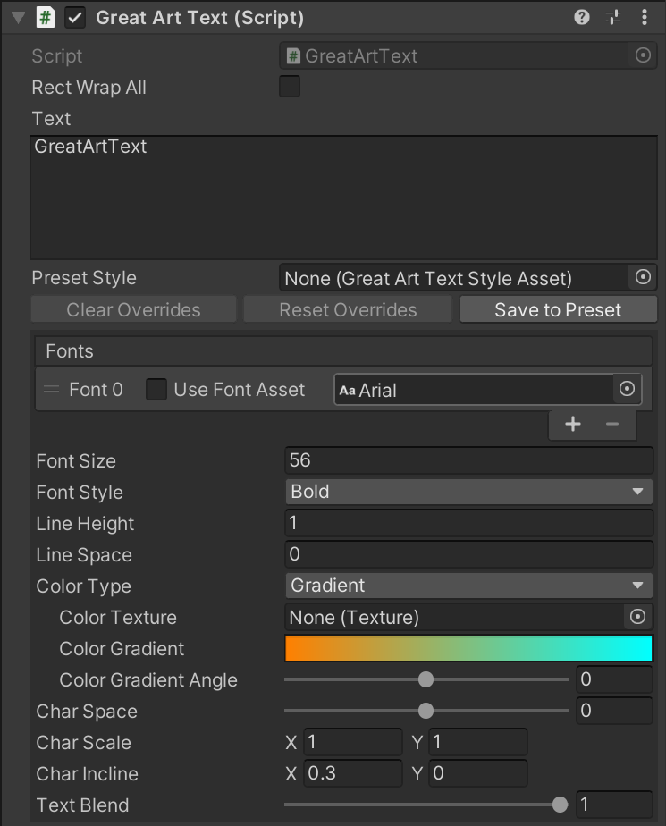

- Text: All content to be shown, including all characters and tags.

- Fonts: All fonts to be used. Font asset can either be dynamic font or intermedia font asset for SDF font. The first font is used by default and the following fonts will be used when required by 'font' tag.

- Font Size: Default font size used when requiring characters from dynamic font.

- Font Style: Default font style used when requiring characters from dynamic font. It specifies whether the bold and italic style are applied to characters.

- Line Height: Font-size-relative part of final line height. 1 by default which means 1 multiplies font size.

- Line Space: Increment pixels part of final line height.

- Color Type: How the text color is specified.
  
  - Color: Pure color is used. And a color value is required.
  
  - Gradient: The gradient value is used by the whole art text.
  
  - Gradient Per Char: The colors in gradient value are used by each character.
  
  - Texture: The colors in texture are used by the whold art text.
  
  - Texture Per Char: The colors in texture are used by each character.
  
  Note: When gradient is used, the direction that gradient goes along with should be specified by an angle in degree. When texture is used, the scale and offset of uv should be specified together with texture asset.

- Char Space: Space between sequential characters in pixels.

- Char Scale: Character scale along x and y axis.

- Char Incline: Character incline in horizontal and vertical direction.

- Text Blend: The opaque of original colored text.

Demo for preview:


#### Configure Trapezoid Transform

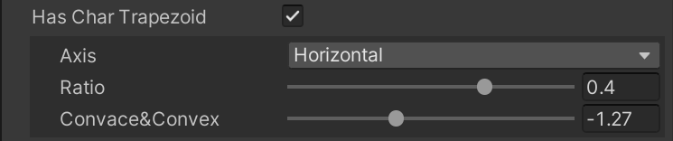

- Has Char Trapezoid: Whether character trapezoid transform is on or not.

- Axis: The axis of parallel edges of the trapezoid, Horizontal or Vertical.

- Ratio: The ratio of parallel edges' length

- Convace & Convex: The convace or convex of the unparallel edges. If not zero then the unparallel edges will not be straight.

Demo for preview:


#### Configure Spacial FX (Shadow, Perspective3D, Orthographic3D)

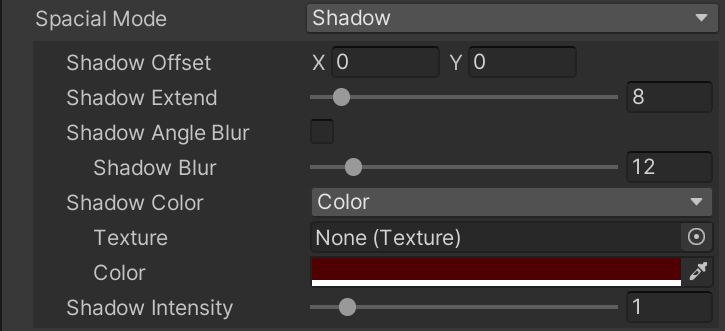

- Spacial Mode: Should be one of 'None, Shadow, Perspective3D, Orthographic3D'.

Shadow: Simulates a shadow casting from text to an underlying surface.

- Shadow Offset: Position offset between text and shadow.

- Shadow Extend: 8-direction extension in pixels from original shadow-text area.

- Shadow Angle Blur: Blur differs in orthometric directions when enabled.
  
  - Shadow Blur: Shadow blur size in pixels. It only works when 'Shadow Angle Blur' is off.
  
  - Shadow Blur Direction: Shadow blur direction in degree. It only works when 'Shadow Angle Blur' is on.
  
  - Shadow Blur Along And Cross: Shadow blur size in pixels along blur direction and its perpendicular direction. It only works when 'Shadow Angle Blur' is on.

- Shadow Color: How the shadow is colored.

- Shadow Intensity: The value multiplied to colored blur results.

Perspective3D: Simulates the presentation of a 3D text viewed by perspective camera.

- Spacial Light 360: The circle light that intowards lit the 3D text. RGB: light color, Alpha: darken or enlighten the origin text color.

- Spacial Light Phase: The circle light angle offset.

- Spacial Light Soft: Text edge smoothness when calculating lights.

- Perspective 3d End Point: The point that the 3D text disappears in perspective view.

- Perspective 3d Stretch: The depth of 3D text, linear scale from 0-depth to full infinit-depth.

- Spacial Faded: How color faded along depth. RGB: the distant color, Alpha: the value that RGB blends.

Orthographic3D: Simulates the presentation of a 3D text viewed by orthographic camera.

- Spacial Light 360: The circle light that intowards lit the 3D text. RGB: light color, Alpha: darken or enlighten the origin text color.

- Spacial Light Phase: The circle light angle offset.

- Spacial Light Soft: Text edge smoothness when calculating lights.

- Orthographic 3d Direction: The direction in degree that text extends in depth.

- Orthographic 3d Length: The depth extended size in pixels.

- Spacial Faded: How color faded along depth. RGB: the distant color, Alpha: the value that RGB blends.

Demo for preview:


#### Configure Text Outline

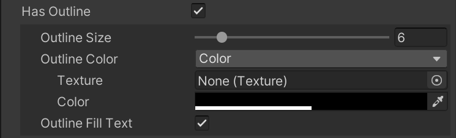

- Has Outline: Whether the text outline is on.

- Outline Size: Width of the outline outside the original text in pixels.

- Outline Color: How the outline is colored.

- Outline Fill Text: If true then outline will fill the original text area. If 'Text Blend' is 0, you will see outline is just an extension of original text area. If false, the region in original text area will be culled.

Demo for preview:


#### Configure Inner FX (inner shadow, inner light or emboss)

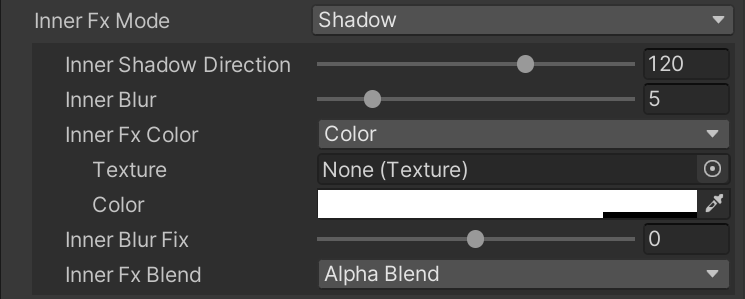

- Inner Fx Mode: Should be one of 'None, Light, Shadow or Emboss'.

Light: Blur inwards from text edge.

- Inner Blur: Blur size in pixels inwards from text edge. 

- Inner Fx Color: How the inner FX is colored.

- Inner Blur Fix: Curve fix for blur result to strengthen or weaken FX color.

- Inner Fx Blend: The blend mode of colored blur result, should be eigher 'Alpha Blend' or 'Additive'.
  
  - Inner Fx Multiply: Value multiplied to colored blur result before additive blend. The value may be negative.

Shadow: Single-direction or ray blur inwards from text edge.

- Inner Shadow Direction: Blur direction or shadow direction in degree.

- Inner Blur: The blur size of the shadow in pixels inwards from text edge.

- Inner Fx Color: How the inner FX is colored.

- Inner Blur Fix: Curve fix for blur result to strengthen or weaken FX color.

- Inner Fx Blend: The blend mode of colored blur result, should be eigher 'Alpha Blend' or 'Additive'.
  
  - Inner Fx Multiply: Value multiplied to colored blur result before additive blend. The value may be negative.

Emboss: The origin text area will rise when going inward from text edge. With light, Emboss will make text look like a 3D surface.

- Emboss Light Direction: The direction in degree that the light comes from.
- Emboss Intensity: The intensity that the light shines and shadows.
- Emboss Bevel: The size in pixel of the width that text area rises.

Demo for preview:


#### Configure Glow FX for Text and Other FXs

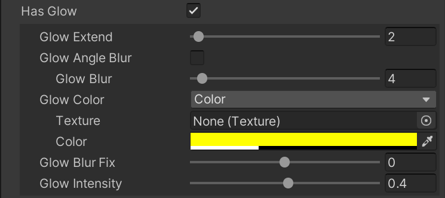

- Has Glow: Whether text glow FX is on or not.

- Glow Extend: Region extend in pixels from original text area before calculating blur.

- Glow Angle Blur: Blur differs in orthometric directions when enabled.
  
  - Glow Blur: Blur size in pixels when calculating glow. It only works when 'Glow Angle Blur' is off.
  
  - Glow Blur Direction: Blur direction in degree. It only works when 'Glow Angle Blur' is on.
  
  - Glow Blur Along And Cross: Blur size in pixels along blur direction and its perpendicular direction. It only works when 'Glow Angle Blur' is on.

- Glow Color: How the glow FX is colored.

- Glow Intensity: The value multiplied to colored blur results before added to final texture.

Demo for preview:


### Working with 3D Text

#### Perspective and Orthographic

`Perspective` and `Orthographic` in 3D text are similar to those of `Projection` in  `Camera` in both logic and view. There will always be an end point in `Perspective3D` text. It is where the 3D text will disappear when its depth is going to infinity.

It is different when specifing the depth of `Perspective3D` and `Orthographic3D` Text. When a 3D text is `Perspective3D`, a property called `Perspective 3d Stretch` will be used as a linear progress value between 0 and 1 to stretch from 0 depth to text-endpoint depth. When a 3D text is `Orthographic3D`, the depth is specified by `Orthographic 3d Length` in pixels that goes along a specific direction.

Perspective 3D text demo:


Orghographic 3D text demo:


#### Make 3D Text Profile Look Real

The original color of 3D text profile is the color of the text edge. When making a 3D text, the color of 3D text profile should be modified by darkening or brightening the original color, or blending light color to the original color according to the tangent of every segment of profile.

The following 2 parts of FXs are specified by one Gradient. The nose and tail of the gradient are logically connected so that it is a ring actually, which shines inside from outside of the text. When calculating lights, only the angle of surface will be considered, and light will never attenuate and never cast or receive shadows.

When calculating the tangents of 3D text profile, edge softening is required in order to make profile smooth and away from aliasing. `Spacial Light Soft` property is used to make text edge soft when calculating lights。

##### Brightening and Darkening Profiles

The Alpha channel in circle-light specified by Gradient is used to specifing the brightening or darking of 3D text profile in direction of 360 degree.

'Hard Light' blend mode is used for brightening and darkening. When the Alpha value is 0-127 the profile color is faded from black - origin color. When the Alpha value is 128-255, the profile color is faded from origin color - white.

The brightening and darkening calucation is prior to color blending, and the result color is the base color used for light blending.

##### Shines the 3D Text Profile via Colored Light

The RGB channels in circle-light specified by Gradient demonstrate the light color from all direction in text plane. The colored is blended with the brightened or darkened profile color with the 'Screen' blend mode. When the value in one of RGB channels varies from 0 to its max value, the value of the channel that returns varies from origin color value to the max value.

#### Spacial Faded: Color fading along depth axis

In real world, distant objects will look dim because of fog and dust in the air.

In order to simulate the color change when distance of profile increases, a property named `Spacial Faded` is defined to specify the distant profile color. The RGB in this color specify the color of the most distant end of profile, and Alpha specifies the blending of the RGB in this color to the profile color.

With this property, fake 3D effect may look real.

### Using TMP_FontAsset

#### Generate Intermedia C# File for TMP_FontAsset

Note: If the intermedia c# file already exists, skip this step.

1. Focus to the menu bar, select `Tools -> Great Art Text -> Generate Font Support for TMP`.

2. Select a folder in your project in the popup dialog. A c# file named TMPFontAssetForGreatArtText.cs will be generated in this folder.

3. Waiting for code compiling.

#### Generate Intermedia Asset for Specific TMP_FontAsset

1. Right click when selected a target folder in 'Project' window, then select `Create -> Great Art Text -> New Asset for TMP_FontAsset`.

2. Rename the generated asset.

3. Select the created asset, focus to Inspector window and specify a TMP_FontAsset asset to `Fonts` property.

#### Switch Font Mode for Item in Fonts List

1. Select a preset style asset or a `GameObject` with `GreatArtText` component on it, find `Fonts` property and make sure there's more than one items in it.

2. Check the toggle box in front of `Use Font Asset`. The type of object reference box will be changed from `Font` into `BaseFontAsset`. The reference to previous `Font` typed asset will be cleared.
   
   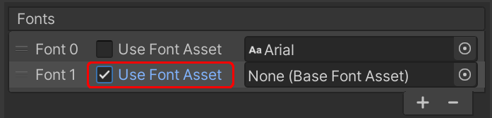

3. Specify an asset with type `BaseFontAsset` to the item in `Fonts` list. Intermedia font asset for TMP should be of type `TMPFontAssetForGreatArtText`.

### Using Preset Sytle Asset

#### Create a New Preset Style Asset

- Right click when selected a target folder in 'Project' window, then select `Create -> GreatArtText -> New Great Art Text Style`. A new preset style asset with default name `NewGreatArtTextStyle` will be created.

- When a preset style asset is selected, all modifiable properties together with preview image will be shown in inspector window.
  
  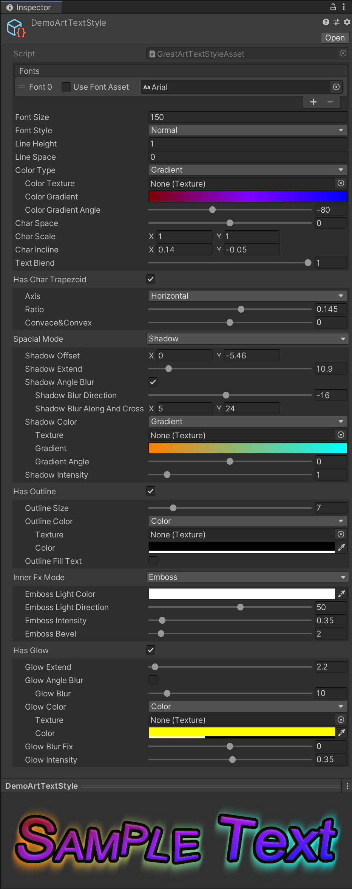

#### Apply Preset Style Asset

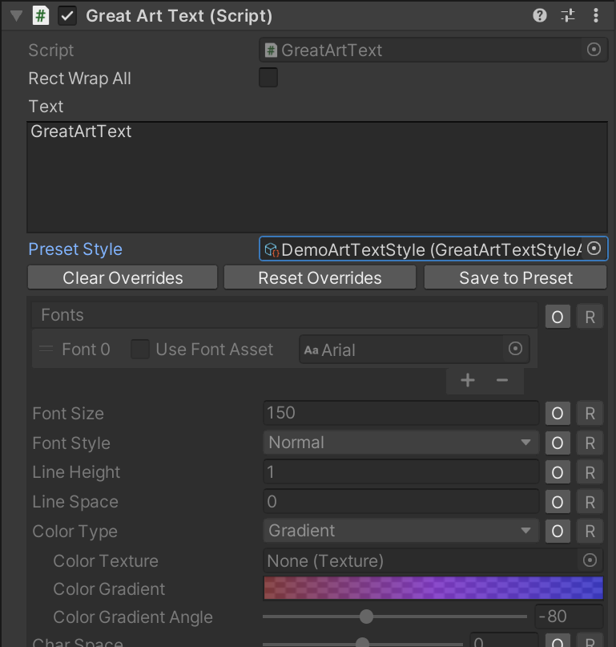

If a preset style asset is assigned to 'Preset Style' in 'GreatArtText' component, the three buttons under 'Preset Style' will be enabled. The showing of properties in this component will also change. Two buttons will be shown on the right of each property.

- 'O' button after each property: Switch override state of property. If a property is overrided, art text will use the property value in component instead of the value in preset style asset.

- 'R' button after each property: Reset the property value to corresponding value in preset style asset. The override state sill not be changed. When 'shift' key is held 'R' button will change into 'S' button. 'S' button is used for saving overrided property value to preset style asset. Note: Preset style asset will be changed when 'S' button is clicked.

- 'Clear Overrides' button: Clear all override states of all properties. The art text will completely be the style of preset style asset after this operation.

- 'Reset Overrides' button: Reset all overrided properties values to corresponding values in preset style asset. The override states will not be unchanged.

- 'Save to Preset' button: Save all overrided properties values into preset style asset. Note: Preset style asset will be changed in this operation.

### Redefining Text Style and Layout for Sub Texts by Using Tags

Tags are used for controlling text style and text layout of any sub texts.

The tags in this plugin is similar to html or xml tags, with the max consistency in name and using with tags in UGUI Text and TMP.

Some tags require paired closing tag, but some tags do not.

For all available tags in text, see [All Supported Rich Text Tags].

### Drawing Art Text into Texture by Coding

#### API for Drawing Art Text

##### TextToRenderTexture. RenderText Method

```csharp
// Draw text and its FXs into a RenderTexture.
public static ArtTextTexture RenderText(
    // Dynamic font asset, should not be null.
    Font font,
    // Text content, rich text is supported.
    string content,
    // Default font size.
    int fontSize,
    // Specify font style, bold or not and italic or not.
    FontStyle style,
    // All parameters of art text FXs.
    Parameter paras,
    // Specify how the returned rendertexture is created.
    eRenderTextureAllocType allocType
);

// Draw text and its FXs into a RenderTexture.
public static ArtTextTexture RenderText(
    // Dynamic font array. Size of the array must be greater then 0, and all fonts used my content should not be null.
    Font[] fonts,
    // Text content, rich text is supported.
    string content,
    // Default font size.
    int fontSize,
    // Specify font style, bold or not and italic or not.
    FontStyle style,
    // All parameters of art text FXs.
    Parameter paras,
    // Specify how returned rendertexture is created.
    eRenderTextureAllocType allocType
);

// Draw text and its FXs into a RenderTexture.
public static ArtTextTexture RenderText(
    // Custom  font array. Size of the array must be greater then 0, and all fonts used my content should not be null.
    IFontInternal[] fonts,
    // Text content, rich text is supported.
    string content,
    // Default font size.
    int fontSize,
    // Specify font style, bold or not and italic or not.
    FontStyle style,
    // All parameters of art text FXs.
    Parameter paras,
    // Specify how returned rendertexture is created.
    eRenderTextureAllocType allocType
);
```

###### TextToRenderTexture.ArtTextTexture Struct

```csharp
// Data type that 'RenderText' method returns.
public struct ArtTextTexture {
    // Texture containing art text.
    public RenderTexture texture;
    // Zero point of text in texture coordinate (lower-left based).
    public Vector2 origin;
    // Text rect area in texture coordinate (lower-left based).
    public Rect rect;
}
```

###### TextToRenderTexture.Parameter Struct

```csharp
// Data struct that defining all art text FXs.
public struct Parameter {

    // Set line height (new line vertical offset)
    // Final line height = height * fontSize + space
    public Parameter SetLineHeightAndSpace(
        // Font-size-relative part of final line height. 1 by default which means 1 multiplies font size.
        float height,
        // Increment pixels part of final line height.
        float space
    );

    // Specify a pure color for coloring text.
    public Parameter SetTextColor(Color color);

    // Specify a gradient color and its direction for coloring text.
    public Parameter SetTextGradient(
        // How colors changed.
        Gradient gradient,
        // The direction that gradient goes along with.
        float angle,
        // True for gradient in every single char, false for gradient in whole text.
        bool perChar
    );

    // Specify a texture for coloring text.
    public Parameter SetTextTexture(
        // Texture for coloring text.
        Texture tex,
        // True for texturing in every single char, false for texturing in whole text.
        bool perChar
    );

    // Specify a texture togegher with tiling and offset for coloring text.
    public Parameter SetTextTexture(
        // Texture for coloring text
        Texture tex,
        // The placement scale of the texture.
        Vector2 tiling,
        // The placement offset of the texture.
        Vector2 offset,
        // True for texturing in every single char, false for texturing in whole text.
        bool perChar
    );

    // Set the space between sequential characters in pixel.
    public Parameter SetCharSpace(float space);

    // Set incline transform to make chars outer rect transformed into parallelogram.
    public Parameter SetIncline(
        // incline.x: The horizontal offset between bottom and top edges.
        // incline.y: The vertical offset between left and right edges.
        Vector2 incline
    );

    // Set opaque value of original colored text.
    public Parameter SetTextBlend(float blend);

    // Set character default scale along x and y axis.
    public Parameter SetScale(Vector2 scale);

    // Set trapezoid transform of which unparallel edges are horizontal edges.
    public Parameter SetCharTrapezoidHorizontal(
        // Length ratio of parallel edges.
        float ratio,
        // The unparallel edges will not be straight if this value is not 0, the two edges will be curved into concave or convex.
        float concave_convex
    );

    // Set trapezoid transform of which unparallel edges are vertical edges.
    public Parameter SetCharTrapezoidVertical(
        // Length ratio of parallel edges.
        float ratio,
        // The unparallel edges will not be straight if this value is not 0, the two edges will be curved into concave or convex.
        float concave_convex
    );

    // Set offline FX of text.
    public Parameter SetOutline(
        // The size of outline in pixels.
        float size,
        // How the outline is colored.
        FxColor color,
        // Outline FX will fill original text area if true, culled if false.
        // When 0 is passed into 'SetTextBlend' method, outline area will be shown as an extend of original text area.
        bool fill_text
    );

    // Clear and turn off outline FX.
    public Parameter ResetOutline();

    // Set directional shadow FX.
    public Parameter SetSpacialShadow(
        // Placement offset between shadow and original text.
        Vector2 offset,
        // Region extend in pixels from original text area before calculating shadow blur.
        float extend,
        // Blur direction in degree.
        float blur_angle,
        // Blur size in pixels along blur direction and its perpendicular direction.
        Vector2 blur,
        // How the shadow is colored.
        FxColor color,
        // The value multiplied to colored shadow blur results before added to final texture.
        float intensity
    );

    // Set shadow FX.
    public Parameter SetSpacialShadow(
        // Placement offset between shadow and original text.
        Vector2 offset,
        // Region extend in pixels from original text area before calculating shadow blur.
        float extend,
        // Shadow blur size in pixels.
        float blur,
        // How the shadow is colored.
        FxColor color,
        // The value multiplied to colored shadow blur results before added to final texture.
        float intensity
    );

    // Set Perspective 3D Text
    public Parameter SetSpacialPerspective3D(
        // The point that the 3D text disappears in perspective view.
        Vector2 endpoint,
        // The depth of 3D text, linear scale from 0-depth to full infinit-depth.
        float stretch,
        // How color faded along depth. RGB: the distant color, Alpha: the value that RGB blends.
        Color faded,
        // The circle light that intowards lit the 3D text. RGB: light color, Alpha: darken or enlighten from origin text color.
        Gradient light360,
        // The circle light angle offset.
        float phase,
        // Text edge smoothness when calculating lights.
        float lightSoft
    );

    // Set Orthographic 3D Text
    public Parameter SetSpacialOrthographic3D(
        // The direction in degree that text extends in depth.
        float dir,
        // The depth extended size in pixels.
        float length,
        // How color faded along depth. RGB: the distant color, Alpha: the value that RGB blends.
        Color faded,
        // The circle light that intowards lit the 3D text. RGB: light color, Alpha: darken or enlighten from origin text color.
        Gradient light360,
        // The circle light angle offset.
        float phase,
        // Text edge smoothness when calculating lights.
        float lightSoft
    );

    // Clear and turn off Shadow, Perspective3D or Orthographic3D FX.
    public Parameter ResetSpacial();

    // Set blur FX inwards from text edge using additive blend.
    public Parameter SetInnerAlphaBlend(
        // Blur size in pixels inwards from text edge.
        float blur,
        // How the inner FX is colored.
        FxColor color,
        // Curve fix for blur result to strengthen or weaken FX color.
        float blur_fix
    );

    // Set shadow in original text area using alpha blend.
    // This FX is similar to inner directional blur, but blur goes in just one side.
    public Parameter SetInnerShadowAlphaBlend(
        // The direction that shodow blur goes along.
        float blur_angle,
        // The blur size of the shadow in pixels inwards from text edge.
        float blur,
        // How the inner shadow is colored.
        FxColor color,
        // Curve fix for blur result to strengthen or weaken FX color.
        float blur_fix
    );

    // Set blur FX inwards from text edge using additive blend.
    public Parameter SetInnerAdditive(
        // Blur size in pixels inwards from text edge.
        float blur,
        // How the inner FX is colored.
        FxColor color,
        // Curve fix for blur result to strengthen or weaken FX color.
        float blur_fix,
        // Value multiplied to colored blur result before additive blend. The value may be negative.
        float multiply
    );

    // Set shadow in original text area using additive blend.
    // This FX is similar to inner directional blur, but blur goes in just one side.
    public Parameter SetInnerShadowAdditive(
        // The direction in degree that shodow blur goes along.
        float blur_angle,
        // The blur size of the shadow in pixels inwards from text edge.
        float blur,
        // How the inner shadow is colored.
        FxColor color,
        // Curve fix for blur result to strengthen or weaken FX color.
        float blur_fix,
        // Value multiplied to colored blur result before additive blend, may be negative
        float multiply
    );

    // Set Emboss FX in original text area.
    public Parameter SetInnerEmboss(
        // Where the light comes from in degree.
        float light_angle,
        // The intensity of shines and shadows.
        float light_intensity,
        // The bevel size in pixel inwards from text edge.
        float bevel
    );

    // Clear and turn off inner FX.
    public Parameter ResetInner();

    // Set glow FX by using single-direction blur.
    // Glow FX works on text and all previous FXs.
    public Parameter SetGlow(
        // Region extend in pixels from original text area before calculating blur.
        float extend,
        // Blur direction in degree.
        float blur_angle,
        // Blur size in pixels along blur direction and its perpendicular direction.
        Vector2 blur,
        // How the glow FX is colored.
        FxColor color,
        // Curve fix for blur result to strengthen or weaken FX color.
        float blur_fix,
        // The value multiplied to colored blur results before added to final texture.
        float intensity
    );

    // Set glow FX by using all-direction blur.
    // Glow FX works on text and all previous FXs.
    public Parameter SetGlow(
        // Region extend in pixels from original text area before calculating blur.
        float extend,
        // Blur size in pixels when calculating glow.
        float blur,
        // How the glow FX is colored.
        FxColor color,
        // Curve fix for blur result to strengthen or weaken FX color.
        float blur_fix,
        // The value multiplied to colored blur results before added to final texture.
        float intensity
    );

    // Clear and turn off glow FX.
    public Parameter ResetGlow();

    // Get data object that defining default art text parameters.
    public static Parameter Default { get; }

}
```

###### TextToRenderTexture.eRenderTextureAllocType Enum

```csharp
// This struct is used for specifing how RenderTexture is allocated.
public enum eRenderTextureAllocType {
    // RenderTexture instance is created via 'new RenderTexture()'.
    // The instance should be released via 'UnityEngine.Object.Destroy()'.'
    Alloc = 0,
    // RenderTexture instance is created via 'RenderTexture.GetTemporary()'.
    // The instance should be released via 'RenderTexture.ReleaseTemporary()'.
    Temporary = 1
}
```

###### TextToRenderTexture.FxColor Struct

```csharp
// This struct is used for specifying how the text and FXs are colored.
// Pure color, gradient color and texture are supported.
public struct FxColor {

    // Specify a texture for the FxColor data object.
    public FxColor SetTexture(Texture texture);

    // Specify a texture with its tiling and offset for the FxColor data object.
    public FxColor SetTexture(
        // Texture for coloring the fx.
        Texture texture,
        // The placement scale of the texture.
        Vector2 tilting,
        // The placement offset of the texture.
        Vector2 offset
    );

    // Create a color data object with a pure color.
    public static FxColor Color(Color color);

    // Create a color data object with a gradient color.
    public static FxColor Gradient(
        // The Unity gradient object.
        Gradient gradient,
        // The direction that gradient go along, 0: left-right, 90: bottom-top.
        float angle
    );

}
```

#### Draw Art Text in [Making an Art Text] via API

The sample code below generates a texture with 'font' style, and save the image into a png file at 'path'.

```csharp
// Create a data object that defining art text parameters.
TextToRenderTexture.Parameter paras = TextToRenderTexture.Parameter.Default;
// Color the text with gradient.
Gradient textGradient = new Gradient() {
    colorKeys = new GradientColorKey[] {
        new GradientColorKey(new Color(1f, 0.5f, 0f), 0f),
        new GradientColorKey(new Color(0f, 1f, 1f), 1f)
    },
    alphaKeys = new GradientAlphaKey[] {
        new GradientAlphaKey(1f, 0f),
        new GradientAlphaKey(1f, 1f)
    },
    mode = GradientMode.Blend
};
// Set gradient color and incline transform.
paras.SetTextGradient(textGradient, 0, false).SetIncline(new Vector2(0.3f, 0f));
// Set trapezoid transform.
paras.SetCharTrapezoidHorizontal(0.4f, -1.27f);
// Set shadow FX.
paras.SetSpacialShadow(Vector2.zero, 8f, 12, TextToRenderTexture.FxColor.Color(new Color(0.3f, 0f, 0f, 1f)), 1f);
// Set outline FX.
paras.SetOutline(6f, TextToRenderTexture.FxColor.Color(new Color(0f, 0f, 0f, 0.5f)), true);
// Set inner light FX with alpha blend.
paras.SetInnerAlphaBlend(3f, TextToRenderTexture.FxColor.Color(new Color(0.3f, 0f, 0f, 1f)), 0f);
// Set glow FX parameters.
paras.SetGlow(2f, 4f, TextToRenderTexture.FxColor.Color(new Color(1f, 1f, 0f, 0.3f)), 0f, 0.4f);
// Draw the art text and acquire the texture.
RenderTexture tex = TextToRenderTexture.RenderText(font, "GreatArtText", 56, FontStyle.Bold,
    paras, TextToRenderTexture.eRenderTextureAllocType.Temporary).texture;

// Encode art text texture (tex) info png file and save it into 'path'.
Texture2D t2d = new Texture2D(tex.width, tex.height, TextureFormat.ARGB32, false, false);
RenderTexture active = RenderTexture.active;
RenderTexture.active = tex;
t2d.ReadPixels(new Rect(0f, 0f, tex.width, tex.height), 0, 0, false);
RenderTexture.active = active;
t2d.Apply(false, false);
System.IO.File.WriteAllBytes(path, t2d.EncodeToPNG());

// Destroy temperory texture2d instance and release art text texture memory
Texture2D.DestroyImmediate(t2d);
RenderTexture.ReleaseTemporary(tex);
```

Note: RenderTexture instance should be destroyed or released when it is no longer used. The API that releasing the RenderTexture inistance should be correspond to eRenderTextureAllocType when drawing the text to avoid memory leak.

## Replacing Preset Styles and Fonts in Runtime

When working with a project that supports various languages in a single released pack, it always requires switching text styles and fonts in rumtime according to current language in use. This plugin-tool enables runtime replacing preset styles and fonts into specific one-to-one matched styles and fonts without modifing asset dependencies.

### Replacing Fonts

The 'Replacing Fonts' feature only works with fonts in `GreatArtText` components or the preset styles that the components reference. When working with drawing art text with API, the fonts you pass into the API will be directly used.

The static delegate `GreatArtText.FontReplacementDynamic` and `GreatArtText.FontReplacementAsset` are the entry of fonts replacement. The following code snippet shows how to replace a dynamic font referenced by `GreatArtText` componets or preset style assets into another correspondingly. The returned font will be the font that used to draw.

```csharp
GreatArtText.FontReplacementDynamic = (Font font) => {
    // fake logics
    if (your_replacement_dict.TryGetValue(font, out Font replacement)) {
        return replacement;
    }
    return font;
};
```

### Replacing Preset Styles

The 'Replacing Preset Styles' only works in runtime. After replacement, the style properties achieved from the replaced preset style will be the properties of the new preset style asset. No dependencies will be changed during the replacement.

Assign another preset style asset to `replacement` property of a `GreatArtTextStyleAsset` asset will make preset style replacement work. When doing so, the modified preset style asset is the one that is being replaced.

```csharp
// The preset style asset referenced by GreatArtText component
private GreatArtTextStyleAsset m_StyleFrom;
// Not referenced by GreatArtText but will be used.
private GreatArtTextStyleAsset m_StyleTo;

void ExecuteStyleReplace() {
    m_StyleFrom.replacement = m_StyleTo;
}
```

## All Supported Rich Text Tags

Note: All demos in this chapter are using 32-sized, black-outlined, Arial-font texts. Demo images may be scaled when showing in this document.

### Text Style

#### Font Style

##### font

This tag is used for specifing the font that some characters use. All available fonts should be listed in GreatArtText component or transfered into drawing API. An integer parameter is used as index to specify which font in the list to be used.

Closing tag is required.

`Sample text <font=1>Font : Chiller</font> sample text`


#### Font Size

##### size

This tag is used for setting font size of some characters.

Closing tag is required.

`Sample text <size=48>Size:48</size> sample text`


`Sample text <size=+8>8 bigger then previous</size> sample text`


`Sample text <size=-6>6 smaller then previous</size> sample text`


`Sample text <size=x1.5>50% bigger then previous</size> sample text <size=*0.7> could be written like this </size>sample text`


#### Text Color

##### color

This tag is used for coloring some characters with pure color.

Closing tag is required.

`Sample text <color=red>red</color> sample text <color=#0F0>green</color> sample text <color=#0000FF>blue</color> sample text`


`Sample text <color=#0F08>semi-transparent green</color> sample text <color=#00FF0080>semi-transparent green</color> sample text`


Color modification base on original color is valid via adding '\*'('x'), '+' or '-' before color value.

`Sample text <color=-red>minus red from white</color> <color=*#gray>set gray</color> <color=*#00FF00>green</color> sample text`


Note: Preset color is available in consistant with colors in Color class. All available color names: red, green, blue, white, black, yellow, cyan, magenta, gray, grey, clear. When '+' or '-' is in use, the alpha channel of the color in tag will not work. Other color or gradient tag inbetween color tag with '\*', 'x', '+' or '-' will not work propertily.

##### gradient

This tag is used for coloring some characters with gradient color in specific direction.

Closing tag is required.

`Sample text <gradient=red-blue,0>per char red-blue gradient from left to right</gradient> sample text`


`Sample text <gradient=#FFFF00-#00FFFF,90> per char yellow-cyan from bottom to top</gradient> sample text`


Note: Defining a color in gradient is the same as it is in color tag. '*', 'x', '+' or '-' in color tag also works here.

#### Bold & Italic

##### b

This tag is used for making some characters bold.

Closing tag is required.

`Sample text <b>bold text</b> sample text`


##### i

This tag is used for making some characters italic.

Closing tag is required.

`Sample text <i>italic text</i> sample text`


##### bi / ib

This tag is used for making some characters bold and italic.

Closing tag is required.

`Sample text <bi>bold and italic</bi> sample text <ib>ib also works</ib> sample text`


##### n

This tag is used for clearing bold and italic state of some characters.

Closing tag is required.

`Sample text <b>bold<i> bold&italic <n>non-bold non-italic</n> bold&italic </i>bold</b> sample text`


### Text Layout

#### Charater Rotation and Transform

##### rot / rotate / rotation

This tag is used for rotating some characters.

Closing tag is required.

`Sample text <rot=10>10 deg counter-clockwise</rot> sample text
Sample text <rotate=-8>8 deg clockwise</rotate> sample text
Sample text <rotation=180>upside-down</rotation> sample text`

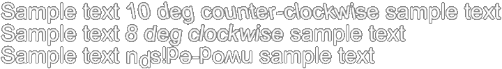

##### incline

This tag is used for controlling the incline or lean transform of some characters. When transforming outer rect of character will be changed into parallelogram.

Closing tag is required.

`Sample text <incline=0.3,0>similar to italic</incline> sample text
Sample text <incline=0,-0.3>stretch along left-top to right-bottom</incline> sample text`


##### scale

This tag is used for controlling the scale of some characters in X and Y axis.

Closing tag is required.

`Sample text <scale=0.6,1>slim</scale> sample text <scale=1,0.6>pudgy</scale> sample text <scale=0.7>small</scale> sample text`


Note: the character in image may be fuzzy if the scale is greater then 1. 

#### Space between Characters

Pixels and times of font size (em) can be used to specify the character space. For Example:

23 : 23 pixels

0.5em : half of current font size

2em-8, 0.5em+10, ... : delta pixels added to times of current font size

##### cspace

This tag is used for specifing the space between some characters. Character space will be set in front of the characters in 'cspace' tag.

Closing tag is required.

`Sample text <cspace=0.2em>char space : 20% font size</cspace> sample text`


##### space

This tag is used for setting the space between its previous character and its following character. It is the same as moving cursor in horizontal axis.

No closing tag is required.

`Sample text A<space=20>A 20px between two 'A's
Sample text A<space=1em-10>A 10px smaller then font size between two 'A's`


#### Character Position Offset

The units for size in character position offset is of the same rule as it is in character spacing.

##### offset

This tag is used for setting position offset of some characters from the position that supposed to be in.

Closing tag is required.

`Together with 'size' tag, x1 square : x<size=*0.5><offset=0,-0.2em>1</offset><offset=-0.5em,0.8em>2</offset></size>`

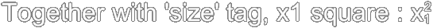

##### voffset

This tag is used for setting vertical position offset of some characters from the position that supposed to be in.

Closing tag is required.

`Together with 'size' tag, x square : x<size=*0.5><voffset=0.8em>2</voffset></size>`

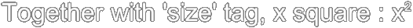

#### Cursor Relocating

The units for size in cursor relocating is of the same rule as it is in character spacing.

##### pos / position / locate

The characters behind this tag will be located to a new position that the parameters of this tag specify.

No closing tag is required.

`Sample ABCDEFG<pos=400,0>Sample 12345<position=0,-50>Sample hijklmn<locate=400,-50>Sample 67890`

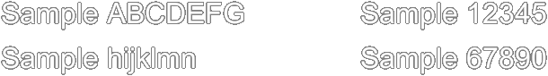

##### move

The characters behind this tag will be located to a new position relative to the end position of previous characters. The parameters of this tag is the position offset.

No closing tag is required.

`Sample text <move=50,30>Upper-right to previous text`


