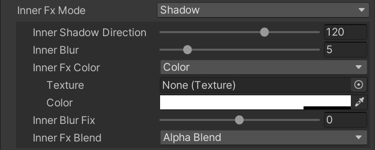
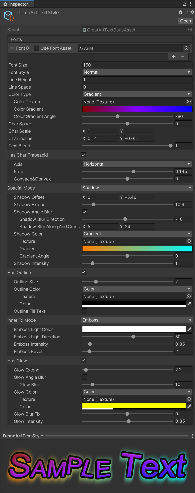
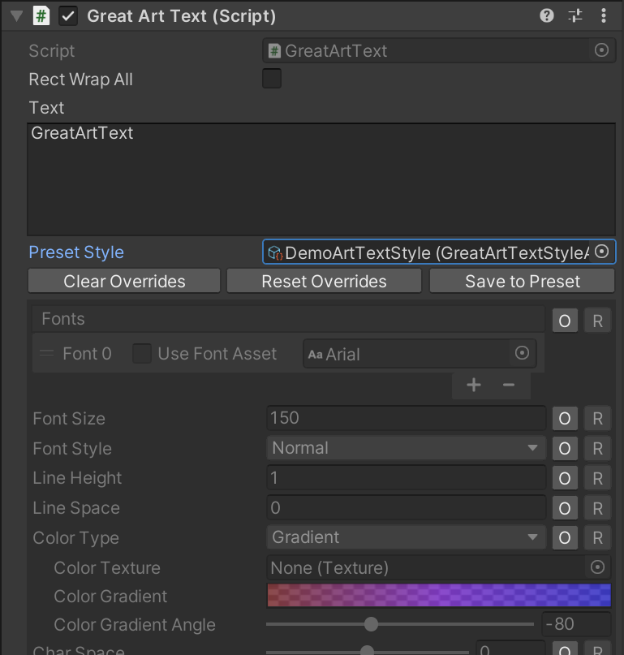

[README](./README.md) in English.

## 概述

此插件工具用于为标题文本、banner文本提供高效、丰富的美术字效果，如高质量高斯模糊的阴影、3D文本、高质量的描边、高亮等效果，以及丰富的文本变形、文本布局支持。

文本及其美术效果将在运行时绘制到贴图中，并以贴图（RawImage）方式渲染，从而减少传统字体渲染方式中每帧的模型及效果渲染开销，同时使这些文本支持RawImage、Image使用的所有基于UGUI的图片效果。

示例：`G<size=*0.7>R<offset=0.015em,0.25em><rot=15>E</rot></offset><rot=10>A</rot>T</size> <b>Art</b> Text`


注：此方案不能替代Text、TMP等传统的渲染文本的方案，此方案仅仅是为了特定场景下为少部分文本实现更丰富的文本效果。

## 特性

- 支持Build-in Render Pipeline与SRP（URP、HDRP）。

- 支持使用动态字体和TMP字体。

- 支持线性颜色空间与gamma颜色空间，相同参数在两颜色空间下生成的贴图完全相同，但由于两颜色空间中在进行alpha混合时alpha乘以的值不同，会导致最终半透明区域的表现不一致。

- 使用RenderTexture进行美术效果及文本的绘制，最终的美术字图片也是RenderTexture。

- 此插件工具在提供了底层绘制API的同时，封装了使用UGUI的RawImage进行渲染的组件，方便制作、使用的同时，保证了兼容性和基于UGUI效果的扩展性。

- 所有效果的颜色属性均支持使用贴图，并叠加以纯色或渐变色。

- 丰富的标签支持，其使用方式与Unity的Text组件、IMGUI及TMP中的富文本标签相同，并尽可能保持一致性。

## 性能

- 在使用了复杂的效果时，向RenderTexture进行的绘制数量约为20余次。经测，在2023年主流移动设备上，同一帧内绘制美术字特效的累计SetPassCall数量若超过百次，可能会造成明显卡帧。

- 若在同一帧绘制多个美术字效果，会造成向动态字体多次请求需要的字符的操作，可能会有明显的CPU时间开销。

- 所有涉及模糊计算的效果，都会有额外的四次SetPassCall。若需要一像素描边，建议用阴影的扩展，但不开启阴影的模糊。

## 操作

### 制作美术字

#### 创建美术字对象

在UGUI节点中创建一个空GameObject，并为其增加GreatArtText组件。

GreatArtText组件依赖RawImage组件，所以为GameObject增加GreatArtText组件时，会自动为这个GameObject增加RawImage和CanvasRenderer组件。

#### 设置基础属性


- Text：要显示的文本内容，包含所有文本字符和文本标签。

- Fonts：使用的字体列表，列表中的字体可以是动态字体，也可以是为支持SDF字体而生成的中间键资源。默认使用第一个字体，如需要使用列表中的其他字体，需要font标签进行配合。

- Font Size：向动态字体请求字符时使用的默认的字体大小。

- Font Style：向动态字体请求字符时使用的默认的字体样式（粗体，斜体）。

- Line Height：行高中文本尺寸的相对倍数。

- Line Space：行高中的绝对增量尺寸部分。

- Color Type：文本的上色方式。
  
  - Color：使用纯色模式为文本上色，需要为其指定颜色。
  
  - Gradient：使用渐变色模式为所有文本整体上色。
  
  - Gradient Per Char：使用渐变色模式为每个字符单个上色。
  
  - Texture：使用贴图纹理为所有文本整体上色。
  
  - Texture Per Char：使用贴图纹理为每个字符单个上色。
  
  注：使用渐变色为文本上色时，除需要指定渐变色外，还要指定渐变色的方向；使用贴图为文本上色时，除指定贴图外，还要指定其uv缩放及起始位置。

- Char Space：字符间距（像素）。

- Char Scale：文本横纵轴的缩放。

- Char Incline：文本在横向和纵向的倾斜。

- Text Blend：仅上色的文本的不透明度。

效果预览：


#### 设置梯形变形


- Has Char Trapezoid：是否开启梯形变形

- Axis：指定的梯形的平行两边是水平两边（Horizontal）或者竖直两边（Vertical）。

- Ratio：平行的两边的尺寸差异

- Convace & Convex：非平行两边的凸与凹，当此值不为零时，梯形的不平行的两边不是直线。

效果预览：


#### 设置文本立体效果（阴影、透视3D效果，正交3D效果）


- Spacial Mode：指定立体效果（None, Shadow, Perspective3D, Orthographic3D）

阴影（Shadow）：模拟文本向下方平面投射阴影

- Shadow Offset：阴影与文本的位置偏移

- Shadow Extend：阴影区域相对于文本区域的扩展

- Shadow Angle Blur：是否开启按指定的角度方向上两轴差异的模糊效果
  
  - Shadow Blur：阴影模糊数值（像素），仅在未开启Shadow Angle Blur时使用
  
  - Shadow Blur Direction：阴影模糊方向（角度），仅在开启Shadow Angle Blur时使用
  
  - Shadow Blur Along And Cross：阴影模糊方向与它垂直方向上的模糊数值（像素），仅在开启Shadow Angle Blur时使用

- Shadow Color：阴影颜色

- Shadow Intensity：阴影强度，乘以模糊计算结果的数值

透视3D效果（Perspective3D）：使文本有厚度并模拟透视相机拍摄到的3D效果

- Spacial Light 360：文本外围照亮立体文本的环形光。其中RGB用于定义光的颜色，Alpha用于提亮或压暗原始文本颜色。

- Spacial Light Phase：环形光方向角度偏移。

- Spacial Light Soft：在计算光照过程中，用于平滑文本边缘的立体面。

- Perspective 3d End Point：立体文本在最远端时的透视消失点。

- Perspective 3d Stretch：立体文本的厚度，范围0-1，代表从无厚度到延伸至消失点无限厚度的线性变化。

- Spacial Faded：立体文本的最远端颜色，其中RGB用于定义颜色，Alpha用于指定该颜色的混合程度。

正交3D效果（Orthographic3D）：使文本有厚度并模拟正交相机拍摄到的3D效果

- Spacial Light 360：文本外围照亮立体文本的环形光。其中RGB用于定义光的颜色，Alpha用于提亮或压暗原始文本颜色。

- Spacial Light Phase：环形光方向角度偏移。

- Spacial Light Soft：在计算光照过程中，用于平滑文本边缘的立体面。

- Orthographic 3d Direction：立体文本延伸的方向（角度）。

- Orthographic 3d Length：立体文本延伸的长度（像素）。

- Spacial Faded：立体文本的最远端颜色，其中RGB用于定义颜色，Alpha用于指定该颜色的混合程度。

效果预览：


#### 设置文本外边框


- Has Outline：是否开启外边框效果

- Outline Size：描边宽度（像素）

- Outline Color：描边颜色

- Outline Fill Text：原文本处是否绘制描边，若Text Blend属性值为0，则能够看到描边实为文本区域的扩大；若此属性为false，描边中文本区域会被剔除

效果预览：


#### 设置原始文本内部效果（内阴影、内发光、浮雕效果）



- Inner Fx Mode：原始文本内部效果的模式（None，Light，Shadow，Emboss）

发光模式（Light）：由原始文本填充区域外向内模糊

- Inner Blur：内发光效计算中的模糊数值（像素）

- Inner Fx Color：向内模糊部分的颜色

- Inner Blur Fix：用于调整模糊计算结果的强度曲线

- Inner Fx Blend：内发光/内阴影效果中模糊计算结果的混合模式，支持Alpha混合和叠加模式。
  
  - Inner Fx Multiply：模糊颜色叠加前乘以的系数，可以为负数

阴影模式（Shadow）：由文本填充区域外向内在单一方向上进行模糊

- Inner Shadow Direction：内阴影模糊方向（角度）

- Inner Blur：内阴影模糊数值（像素）

- Inner Fx Color：向内模糊部分的颜色

- Inner Blur Fix：用于调整模糊计算结果的强度曲线

- Inner Fx Blend：内发光/内阴影效果中模糊计算结果的混合模式，支持Alpha混合和叠加模式。
  
  - Inner Fx Multiply：模糊颜色叠加前乘以的系数，可以为负数

浮雕效果（Emboss）：文本区域从边缘向内部逐渐隆起，通过给定的光源方向展示隆起后的光影效果，使文本增加立体感。

- Emboss Light Direction：The direction in degree that the light comes from.
- Emboss Intensity：光线影响光影的强度
- Emboss Bevel：从文本边缘向内隆起的像素数

效果预览：


#### 设置文本及效果的高亮


- Has Glow：是否开启高亮效果

- Glow Extend：计算模糊前的区域相对于文本区域的扩展

- Glow Angle Blur：是否开启按指定的角度方向上两轴差异的高亮模糊效果
  
  - Glow Blur：高亮效果计算中的模糊数值（像素），仅在未开启Glow Angle Blur时使用
  
  - Glow Blur Direction：高亮效果计算中的模糊方向（角度），仅在开启Glow Angle Blur时使用
  
  - Glow Blur Along And Cross：高亮模糊方向与它垂直方向上的模糊数值（像素），仅在开启Glow Angle Blur时使用

- Glow Color：高亮叠加的颜色

- Glow Intensity：用于指定发光效果的叠加强度

效果预览：


### 制作3D文本效果

#### 透视与正交

3D文本的透视与正交与摄像机的透视与正交属性及渲染3D物体时的视觉效果类似。其中透视效果的3D文本有一个透视消失点，即3D文本的厚度（垂直于文本平面的3D文本的深度）在无限延伸后最终汇聚到的那个点。

透视与正交的3D文本，在定义其厚度的方法上也有不同。透视文本的深度，通过一个0~1的数值来表示从没有深度到达到消失点的最大深度之间的线性变化；正交文本的深度，为直接指定的在延伸方向上的像素数。

透视3D文本效果：


正交3D文本效果：


#### 3D文本侧面的立体感

3D文本的侧面的原始颜色为文本边缘的颜色，在制作3D文本效果时，可以上下调整侧面在各方向上原始颜色的明度值（提亮与压暗），也可以在侧面原始颜色的基础上叠加对应角度上其他颜色的光。

下述两部分光影效果使用同一个Gradient来定义，此Gradient首尾相接，形成一个环形光，作用于立体文本的外围。光影计算中，只考虑其角度，没有光强随距离衰减及遮挡投影的逻辑。

在计算文本边缘的法线方向时，需要进行边缘的柔化，以避免文本边缘锯齿导致的侧面不平滑。`Spacial Light Soft`参数用于定义柔化半径。

##### 提亮与压暗边缘

使用环形光Gradient中的Alpha通道来定义3D文本侧面在360度方向内的明暗变化。

参照“强光”混合模式，当Alpha的值为0-127时，侧面颜色为黑色-原始边缘颜色，当Alpha为128-255时，侧面颜色为原始边缘颜色-白色。

在计算侧面颜色光前，首先计算提亮与压暗，并以此颜色为基础进行颜色光的叠加。

##### 照亮3D文本侧面的颜色光

环形光Gradient的RGB代表平面内文字周围所有方向上的光的颜色，此颜色与计算过提亮与压暗的侧面颜色进行混合，并使用滤色混合模式，即光的颜色中某通道数值为0时，将使用原侧面颜色该通道的数值，某通道数值为最大时，将使用此最大的数值。

#### 随深度增加的颜色变化（Spacial Faded）

在现实场景中，远距离的物体会因为空气中的雾与灰尘而降低了颜色饱和度呈现为偏灰色。

为模拟3D文本远处的颜色变化，此工具为3D文本定义了最远端的颜色属性，即`Spacial Faded`。其中RGB代表文本最远处的颜色值，Alpha代表该RGB颜色值在文本最远处对文本侧面颜色的混合程度。

使用此特性会使3D文本深度更有层次，3D效果更真实。

### 使用TextMeshPro字体

#### 在工程中生成对TMP_FontAsset支持的中间键代码

注：若中间键代码已经存在，由跳过此步。

1. 在Unity的菜单栏中依次选择 `Tools -> Great Art Text -> Generate Font Support for TMP`。

2. 在弹出的对话框中选择在项目中用于存放中间键代码的文件夹，此工具将会在所选的文件夹中生成TMPFontAssetForGreatArtText.cs文件。

3. 等待编译完成。

#### 为指定TMP字体生成新的字体中间键资源

1. 在Project窗口中的目标文件夹处，点击鼠标右键，依次选择`Create -> Great Art Text -> New Asset for TMP_FontAsset`。

2. 为新建的资源进行重命名。

3. 选中新建的资源，并在Inspector窗口中为`Fonts`属性指定TMP_FontAsset类型的资源。

#### 切换字体列表中的字体类型并使用字体中间键资源

1. 选择预设样式或挂有`GreatArtText`组件的`GameObject`，并在Inspector窗口中找到`Fonts`属性，并保证其列表中包含至少一个元素。

2. 勾选`Use Font Asset`前面的复选框，后面的资源选择框中资源类型将从`Font`变更为`BaseFontAsset`，并取消对原`Font`类型字体的引用。
   
   

3. 为该条目指定`BaseFontAsset`类型的资源，使用TMP字体的中间键字体资源类型为`TMPFontAssetForGreatArtText`。

### 使用预设美术字样式

#### 创建新的样式资源

- 在Project窗口中的目标文件夹处，点击鼠标右键，依次选择`Create -> GreatArtText -> New Great Art Text Style`，即可创建默认名称为`NewGreatArtTextStyle`的美术字样式资源。

- 选中样式资源，可以在Inspector窗口中查看并编辑样式，同时可以在下方预览区域实时看到应用了当前样式的文本效果。
  
  

#### 使用预设美术字样式



GreatArtText组件使用了预设样式后，预设样式属性下方的三个按钮会被激活，组件的属性列表显示状态会发生改变，每个属性后面会增加两个按钮。

- 每个属性后的O按钮：用于切换该属性是否被重写（Override），若属性被重写，美术字将使用重写的属性值来覆盖预设样式中该属性的属性值。

- 每个属性后的R按钮：用于重置（Reset）该属性值到预设样式中的属性值，但保留属性的重写状态。在按下键盘的Shift按键后，此按钮会改为S按钮，S按钮用于保存该重写的属性值到预设样式。注意：点击S按钮将会修改预设美术字样式资源。

- Clear Overrides 按钮：清空所有被重写的属性，点击此按钮后，该处文本将完全使用预设美术字样式。

- Reset Overrides 按钮：将所有被重写的属性的属性值恢复到预设样式中对应的属性的属性值，并保持重写属性的重写状态。

- Save to Preset 按钮：将所有被重写的属性的属性值保存到预设样式中。注意，此操作将会修改预设美术字样式资源。

### 使用文本标签实现文本中部分字符的样式、位置字号等重定义

标签用于控制文本中任意部分内容的文本样式和文本排布。

此插件中的标签类似于 html 或 xml 的标签，并与 IMGUI、UGUI 的 Text 及 TMP 中的 rich text 的标签名称与规则尽可能保持了一致。

部分标签需要成对出现，部分标签不可成对出现。

所有可用的标签，参见文档中 [支持的富文本标签]。

### 使用代码绘制美术字贴图

#### 绘制美术字贴图的API

##### TextToRenderTexture. RenderText 方法

```csharp
// 此插件工具中唯一的绘制美术字效果的方法
public static ArtTextTexture RenderText(
    // 动态字体，不可为空
    Font font,
    // 文本内容，支持富文本
    string content,
    // 默认的字体大小
    int fontSize,
    // 默认的字体样式（粗？斜？）
    FontStyle style,
    // 所有美术字样式参数
    Parameter paras,
    // RenderTexture的创建方式
    eRenderTextureAllocType allocType
);

// 此插件工具中唯一的绘制美术字效果的方法
public static ArtTextTexture RenderText(
    // 动态字体列表，长度必须大于0，文本需要的字体不可为空
    Font[] fonts,
    // 文本内容，支持富文本
    string content,
    // 默认的字体大小
    int fontSize,
    // 默认的字体样式（粗？斜？）
    FontStyle style,
    // 所有美术字样式参数
    Parameter paras,
    // RenderTexture的创建方式
    eRenderTextureAllocType allocType
);

// 此插件工具中唯一的绘制美术字效果的方法
public static ArtTextTexture RenderText(
    // 可使用其他字体类型的字体列表，长度必须大于0，文本需要的字体不可为空
    IFontInternal[] fonts,
    // 文本内容，支持富文本
    string content,
    // 默认的字体大小
    int fontSize,
    // 默认的字体样式（粗？斜？）
    FontStyle style,
    // 所有美术字样式参数
    Parameter paras,
    // RenderTexture的创建方式
    eRenderTextureAllocType allocType
);
```

###### TextToRenderTexture.ArtTextTexture 结构体

此数据结构为`RenderText`方法的返回值的数据类型，`RenderText`方法除返回生成的贴图之外，还返回了文本原点坐标、贴图中特效以外的文本区域的矩形范围。

```csharp
// 绘制美术字贴图的方法的返回对象的数据类型
public struct ArtTextTexture {
    // 美术术字贴图
    public RenderTexture texture;
    // 文本位置原点在图片中的初始位置（图片左下角为坐标原点）
    public Vector2 origin;
    // 文本区域在图片中的区域矩形（图片左下角为坐标原点）
    public Rect rect;
}
```

###### TextToRenderTexture.Parameter 结构体

此数据类型为`RenderText`方法中用于定义文本高级样式参数的数据类型

注：不要通过new关键字创建该数据结构的实例，也不要直接修改该类型数据的属性字段。创建实例需使用`Parameter.Default`，设置样式属性时使用对应的方法。

```csharp
// 绘制美术字文本时用到的所有高级样式参数
public struct Parameter {

    // 设置行高、行间距。
    // 两行起始点竖直方向偏移：height * fontSize + space
    public Parameter SetLineHeightAndSpace(
        // 行高中文本尺寸的相对倍数
        float height,
        // 行高中的绝对增量尺寸部分
        float space
    );

    // 使用纯色模式为文本上色，并设置其颜色。
    public Parameter SetTextColor(Color color);

    // 使用渐变色模式为文本上色，并设置渐变色属性。
    public Parameter SetTextGradient(
        // Unity的渐变色类型的颜色信息
        Gradient gradient,
        // 渐变色方向（角度），0代表从左到右，90代表从下到上
        float angle,
        // true：每个字符内部使用渐变色上色，false：文本整体使用渐变色上色
        bool perChar
    );

    // 使用贴图纹理为文本上色。
    public Parameter SetTextTexture(
        // 贴图
        Texture tex,
        // true：每个字符单独用贴图上色，false：文本整体使用贴图上色
        bool perChar
    );

    // 使用贴图纹理为文本上色，并设置排布属性。
    public Parameter SetTextTexture(
        // 贴图
        Texture tex,
        // uv缩放倍数，与材质的tiling相同
        Vector2 tiling,
        // uv坐标的起始位置，与材质的offset相同
        Vector2 offset,
        // true：每个字符单独用贴图上色，false：文本整体使用贴图上色
        bool perChar
    );

    // 设置字符间距（像素）。
    public Parameter SetCharSpace(float space);

    // 设置文本在横向和纵向的倾斜。
    public Parameter SetIncline(
        // incline.x：用于指定文本上方和下方之间横向的位置偏移
        // incline.y：用于指定文本左侧和右侧之间的纵向位置偏移
        Vector2 incline
    );

    // 设置仅上色的文本的不透明度。
    public Parameter SetTextBlend(float blend);

    // 设置文本横纵轴的缩放。
    public Parameter SetScale(Vector2 scale);

    // 设置梯形变形，其中模型为横置（不等长的两平行边位于左右两边）。
    public Parameter SetCharTrapezoidHorizontal(
        // 平行的两边的尺寸差异
        float ratio,
        // 非平行两边的凸与凹，当此值不为零时，梯形的不平行的两边不是直线
        float concave_convex
    );

    // 设置梯形变形，其中模型为横置（不等长的两平行边位于上下两边）。
    public Parameter SetCharTrapezoidVertical(
        // 平行的两边的尺寸差异
        float ratio,
        // 非平行两边的凸与凹，当此值不为零时，梯形的不平行的两边不是直线
        float concave_convex
    );

    // 设置文本描边。
    public Parameter SetOutline(
        // 描边宽度
        float size,
        // 描边颜色
        FxColor color,
        // 原文本处是否绘制描边
        // 若SetTextBlend方法传入参数为0，则能够看到描边实为文本区域的扩大
        // 若fill_text为false，描边中文本区域会被剔除
        bool fill_text
    );

    // 清除描边。
    public Parameter ResetOutline();

    // 设置方向模糊阴影。
    public Parameter SetSpacialShadow(
        // 阴影与文本的位置偏移
        Vector2 offset,
        // 阴影区域相对于文本区域的扩展
        float extend,
        // 阴影模糊方向（角度）
        float blur_angle,
        // 阴影模糊方向与它垂直方向上的模糊数值（像素）
        Vector2 blur,
        // 阴影颜色
        FxColor color,
        // 阴影强度
        float intensity
    );

    // 设置模糊阴影。
    public Parameter SetSpacialShadow(
        // 阴影与文本的位置偏移
        Vector2 offset,
        // 阴影区域相对于文本区域的扩展
        float extend,
        // 阴影模糊数值（像素）
        float blur,
        // 阴影颜色
        FxColor color,
        // 阴影强度
        float intensity
    );

    // 设置透视立体文本效果
    public Parameter SetSpacialPerspective3D(
        // 立体文本在最远端时的透视消失点
        Vector2 endpoint,
        // 立体文本的厚度，范围0-1，代表从无厚度到延伸至消失点无限厚度的线性变化
        float stretch,
        // 立体文本的最远端颜色，其中RGB用于定义颜色，Alpha用于指定该颜色的混合程度
        Color faded,
        // 文本外围照亮立体文本的环形光，其中RGB用于定义光的颜色，Alpha用于提亮或压暗原始文本颜色
        Gradient light360,
        // 环形光方向角度偏移
        float phase,
        // 在计算光照过程中，用于平滑文本边缘的立体面
        float lightSoft
    );

    // 设置正交立体文本效果
    public Parameter SetSpacialOrthographic3D(
        // 立体文本延伸的方向（角度）
        float dir,
        // 立体文本延伸的长度（像素）
        float length,
        // 立体文本的最远端颜色，其中RGB用于定义颜色，Alpha用于指定该颜色的混合程度
        Color faded,
        // 文本外围照亮立体文本的环形光，其中RGB用于定义光的颜色，Alpha用于提亮或压暗原始文本颜色
        Gradient light360,
        // 环形光方向角度偏移
        float phase,
        // 在计算光照过程中，用于平滑文本边缘的立体面
        float lightSoft
    );

    // 清除或关闭阴影、透视3D或正交3D。
    public Parameter ResetSpacial();

    // 以透明渲染方式在文本内部渲染由外向内的模糊效果。
    public Parameter SetInnerAlphaBlend(
        // 从文本图形以外向文本内部模糊数值（像素）
        float blur,
        // 向内模糊部分的颜色
        FxColor color,
        // 用于调整模糊计算结果的强度曲线
        float blur_fix
    );

    // 以透明渲染方式在文本内部渲染部阴影。
    // 此效果与内部方向模糊类似，但阴影效果只有一个射线方向上的模糊。
    public Parameter SetInnerShadowAlphaBlend(
        // 内部阴影模糊角度
        float blur_angle,
        // 阴影模糊方向上的模糊值（像素）
        float blur,
        // 内部阴影颜色
        FxColor color,
        // 用于调整模糊计算结果的强度曲线
        float blur_fix
    );

    // 以颜色叠加的方式在文本内部渲染由外向内的模糊效果。
    public Parameter SetInnerAdditive(
        // 从文本图形以外向文本内部模糊数值（像素）
        float blur,
        // 向内模糊部分的颜色
        FxColor color,
        // 用于调整模糊计算结果的强度曲线
        float blur_fix,
        // 模糊颜色叠加前乘以的系数，可以为负数
        float multiply
    );

    // 以颜色叠加的方式在文本内部渲染内阴影。
    // 此效果与内部方向模糊类似，但阴影效果只有一个射线方向上的模糊。
    public Parameter SetInnerShadowAdditive(
        // 内部阴影模糊角度
        float blur_angle,
        // 阴影模糊方向上的模糊值（像素）
        float blur,
        // 内部阴影颜色
        FxColor color,
        // 用于调整模糊计算结果的强度曲线
        float blur_fix,
        // 模糊颜色叠加前乘以的系数，可以为负数
        float multiply
    );

    // 设置文本内部区域的浮雕效果。
    public Parameter SetInnerEmboss(
        // 光源方向（角度）
        float light_angle,
        // 光影强度
        float light_intensity,
        // 从文本边缘向内隆起的像素数
        float bevel
    );

    // 清除内部模糊、内阴影效果。
    public Parameter ResetInner();

    // 设置高光效果，其高光区域及强度使用方向模糊进行计算。
    // 高光效果不仅作用于文本，也会叠加其他效果的渲染。
    public Parameter SetGlow(
        // 计算模糊前的区域相对于文本区域的扩展
        float extend,
        // 模糊方向（角度）
        float blur_angle,
        // 高光模糊方向上的模糊值（像素）
        Vector2 blur,
        // 高光叠加的颜色
        FxColor color,
        // 用于调整模糊计算结果的强度曲线
        float blur_fix,
        // 用于指定发光效果的叠加强度
        float intensity
    );

    // 设置高亮效果，其高亮区域及强度使用普通模糊计算。
    // 高效果不仅作用于文本，也会叠加其他效果的渲染。
    public Parameter SetGlow(
        // 高光区域相对于文本区域的扩展（像素）
        float extend,
        // 高光效果的模糊值（像素）
        float blur,
        // 高光叠加的颜色
        FxColor color,
        // 用于调整模糊计算结果的强度曲线
        float blur_fix,
        // 用于指定高亮效果的叠加强度
        float intensity
    );

    // 清除高亮效果。
    public Parameter ResetGlow();

    // 获取高级样式参数数据对象的实例。
    public static Parameter Default { get; }
}
```

###### TextToRenderTexture.eRenderTextureAllocType 枚举

```csharp
// RenderTexture实例的创建方式
public enum eRenderTextureAllocType {
    // 使用 new RenderTexture() 来创建
    // 需要使用 UnityEngine.Object.Destroy() 方法销毁
    Alloc = 0,
    // 使用 RenderTexture.GetTemporary() 来创建
    // 需要使用 RenderTexture.ReleaseTemporary() 方法进行回收
    Temporary = 1
}
```

###### TextToRenderTexture.FxColor 结构体

```csharp
// 用于指定美术字中各种颜色的数据结构，支持纯色、渐变色与使用贴图。
public struct FxColor {

    // 设置FxColor使用贴图纹理中的颜色来渲染FX。
    public FxColor SetTexture(Texture texture);

    // 设置FxColor使用贴图纹理中的颜色，并设置其uv缩放及起始位置。
    public FxColor SetTexture(
        // 贴图
        Texture texture,
        // uv缩放倍数，与材质的tiling相同
        Vector2 tilting,
        // uv坐标的起始位置，与材质的offset相同
        Vector2 offset
    );

    // 使用纯色，并指定颜色。
    public static FxColor Color(Color color);

    // 使用渐变色。
    public static FxColor Gradient(
        // Unity的渐变色类型的颜色信息
        Gradient gradient,
        // 渐变色方向（角度），0：从左向右，90：自下而上
        float angle
    );

}
```

#### 使用API绘制[制作美术字]中的示例

此代码示例使用font字体绘制美术字，并将美术字贴图转成png文件保存在path路径中。

```csharp
// 创建美术字效果参数的数据对象
TextToRenderTexture.Parameter paras = TextToRenderTexture.Parameter.Default;
// 文本上色使用的渐变色
Gradient textGradient = new Gradient() {
    colorKeys = new GradientColorKey[] {
        new GradientColorKey(new Color(1f, 0.5f, 0f), 0f),
        new GradientColorKey(new Color(0f, 1f, 1f), 1f)
    },
    alphaKeys = new GradientAlphaKey[] {
        new GradientAlphaKey(1f, 0f),
        new GradientAlphaKey(1f, 1f)
    },
    mode = GradientMode.Blend
};
// 设置文本渐变色及倾斜
paras.SetTextGradient(textGradient, 0, false).SetIncline(new Vector2(0.3f, 0f));
// 设置梯形变形
paras.SetCharTrapezoidHorizontal(0.4f, -1.27f);
// 设置阴影
paras.SetSpacialShadow(Vector2.zero, 8f, 12, TextToRenderTexture.FxColor.Color(new Color(0.3f, 0f, 0f, 1f)), 1f);
// 设置描边
paras.SetOutline(6f, TextToRenderTexture.FxColor.Color(new Color(0f, 0f, 0f, 0.5f)), true);
// 设置使用alpha混合的内发光效果
paras.SetInnerAlphaBlend(3f, TextToRenderTexture.FxColor.Color(new Color(0.3f, 0f, 0f, 1f)), 0f);
// 设置高亮效果
paras.SetGlow(2f, 4f, TextToRenderTexture.FxColor.Color(new Color(1f, 1f, 0f, 0.3f)), 0f, 0.4f);
// 绘制并获取贴图
RenderTexture tex = TextToRenderTexture.RenderText(font, "GreatArtText", 56, FontStyle.Bold,
    paras, TextToRenderTexture.eRenderTextureAllocType.Temporary).texture;

// 将美术字贴图tex转成png文件并保存到path路径中。
Texture2D t2d = new Texture2D(tex.width, tex.height, TextureFormat.ARGB32, false, false);
RenderTexture active = RenderTexture.active;
RenderTexture.active = tex;
t2d.ReadPixels(new Rect(0f, 0f, tex.width, tex.height), 0, 0, false);
RenderTexture.active = active;
t2d.Apply(false, false);
System.IO.File.WriteAllBytes(path, t2d.EncodeToPNG());

// 销毁临时资源，并释放美术字贴图
Texture2D.DestroyImmediate(t2d);
RenderTexture.ReleaseTemporary(tex);
```

注意：关于RenderTexture对象的内存管理，在对象（实例）不再被使用时，需要根据绘制时使用的eRenderTextureAllocType所对应的销毁或回收方法进行内存释放，以避免内存泄露。

## 动态替换字体及预设样式

在同一个程序包中支持了多个语言的项目中，往往需要根据当前使用的语言来替换字体或预设样式。此工具插件允许在不改变项目中资源关联关系的情况下，在运行时对预设样式及字体进行一一对应的替换。

### 替换字体

替换字体功能，仅适用于`GreatArtText`组件中使用的字体以及其使用的预设样式中的字体。若使用API进行美术字绘制，则需要直接传入需要使用的字体。

字体替换是通过`GreatArtText`中的静态委托`FontReplacementDynamic`和`FontReplacementAsset`实现的。下面的示例展示了如何使用`GreatArtText.FontReplacementDynamic`以实现将`GreatArtText`组件及预设样式资源中引用的动态字体替换为对应的渲染美术字使用的动态字体。

```csharp
GreatArtText.FontReplacementDynamic = (Font font) => {
    // 示例逻辑，方法仅供参考
    if (your_replacement_dict.TryGetValue(font, out Font replacement)) {
        return replacement;
    }
    return font;
};
```

### 替换预设样式

此功能仅在运行时生效，进行替换后，读取被替换的预设样式中的属性时，将返回另一个样式的属性。此过程中`GreatArtText`组件与预设样式资源的关联关系不发生任何变化。

预设样式的替换是通过运行时修改`GreatArtTextStyleAsset`的`replacement`属性来实现的，修改预设样式的`replacement`属性，只对被修改的预设样式资源生效。

```csharp
// 被GreatArtText组件引用的预设样式
private GreatArtTextStyleAsset m_StyleFrom;
// 未被GreatArtText组件引用，真正需要被使用的预设样式
private GreatArtTextStyleAsset m_StyleTo;

void ExecuteStyleReplace() {
    m_StyleFrom.replacement = m_StyleTo;
}
```

## 支持的富文本标签

注：此处所有示例文本，默认都是32号字黑色描边的Arial字体文本，在文档中展示时，效果截图可能会被缩放。

### 文本样式

#### 字体

##### font

用于指定部分字符使用的字体，字体应预先在GreatArtText组件或预设样式的字体列表中设置，并使用索引来确认使用哪个字体。

此标签需要成对出现。

`示例文本<font=1>华文新魏</font>默认字体`


#### 字号

##### size

用于设定部分字符的字号。

此标签需要成对出现。

`示例文本<size=48>48号字</size>示例文本`


`示例文本<size=+8>字号比前面字符的字号大8的文本</size>示例文本`


`示例文本<size=-6>字号比前面字符的字号小6的文本</size>示例文本`


`示例文本<size=x1.5>此处的字比前面的字大50%</size>示例文本<size=*0.7>也可以这样书写</size>示例文本`


#### 文本颜色

##### color

用于以纯色方式设定部分字符的颜色。

此标签需要成对出现。

`示例文本<color=red>红色文本</color>示例文本<color=#0F0>绿色文本</color>示例文本<color=#0000FF>蓝色文本</color>示例文本`


`示例文本<color=#0F08>半透明绿色文本</color>示例文本<color=#00FF0080>半透明绿色文本</color>示例文本`


与乘号（\*或x）、加号（+）或减号（-）配合，可使标签内的文本在原本的颜色基础上进行颜色修改。

`示例文本<color=-red>白色减掉红色</color><color=*#gray>置灰文本</color><color=*#00FF00>绿色文本</color>示例文本`


注：可用的预设颜色与Color类中提供的颜色相同，其名称包含：red, green, blue, white, black, yellow, cyan, magenta, gray, grey, clear。在配合加号或减号时，参数中颜色的alpha部分不起作用。使用乘号、加号或减号的颜色标签，内部不再支持嵌套颜色标签。

##### gradient

用于设定部分字符的颜色为指定方向的渐变色。

此标签需要成对出现。

`示例文本<gradient=red-blue,0>每个字符都是从左到右的红-蓝的渐变色</gradient>示例文本`


`示例文本<gradient=#FFFF00-#00FFFF,90>每个字符都是从下到上的黄-青的渐变色</gradient>示例文本`


注：此标签中使用的预设颜色与颜色的定义方法，与color标签的方法相同。color标签中支持的颜色修改符号也可用于此标签。

#### 粗体、斜体

##### b

用于加粗部分字符。

此标签需要成对出现。

`示例文本<b>粗体文本</b>示例文本`


##### i

用于斜体展示部分字符。

此标签需要成对出现。

`示例文本<i>斜体文本</i>示例文本`


##### bi / ib

用于同时加粗和应用斜体到部分字符。

此标签需要成对出现。

`示例文本<bi>粗斜</bi>示例文本<ib>这样也可以</ib>示例文本`


##### n

用于清除部分字符的加粗、斜体状态。

此标签需要成对出现。

`示例文本<b>粗<i>粗斜<n>不粗不斜</n>粗斜</i>粗</b>示例文本`


### 文本排布

#### 字符旋转变形

##### rot / rotate / rotation

用于控制部分字符的旋转。

此标签需要成对出现。

`示例文本<rot=10>逆时针旋转10度</rot>示例文本
示例文本<rotate=-8>顺时针旋转8度</rotate>示例文本
示例文本<rotation=180>倒置文本</rotation>示例文本`


##### incline

用于控制部分字符的倾斜变形，变形时，文本的轮廓始终是平行四边形。

此标签需要成对出现。

`示例文本<incline=0.3,0>类似斜体效果的文本</incline>示例文本
示例文本<incline=0,-0.3>文本以左上-右下的轴向被拉长</incline>示例文本`


##### scale

用于控制部分字符在横纵两轴的缩放值。

此标签需要成对出现。

`示例文本<scale=0.6,1>细长文本</scale>示例文本<scale=1,0.6>纵向变矮</scale>示例文本<scale=0.7>整体缩小</scale>示例文本`


注：若将文本放大，可能会造成文本边缘模糊。

#### 字符间距

此处的间距，其单位可以是与文本size相同的、最终贴图中的像素，也可以以当前文本的尺寸为单位。例如：

若定义某尺寸为23像素，则可以直接使用：23

若定义某个尺寸为当前文本尺寸的0.5位，则可以使用：0.5em

若某个尺寸需要在当前文本尺寸的数倍上调整数个像素，则可以使用：2em-8 或 0.5em+10

##### cspace

用于定义部分字符的字符间距，应用此标签的所有字符，将在其前面增加相应的间距。

此标签需要成对出现。

`示例文本<cspace=0.2em>这些字符前都有0.2倍文本尺寸的间距</cspace>示例文本`


##### space

一次性定义间距，相当于直接移动光标。

此标签不可成对出现。

`示例文本<space=20>这字前面有20像素的间距
示例文本<space=1em-10>这字前面有比一个文本尺寸宽度少10像素的间距`


#### 字符移位

此处的尺寸单位与字符间距的规则相同。

##### offset

用于定义字符与其默认位置的偏移。

此标签需要成对出现。

`结合size标签，显示x1的平方：x<size=*0.5><offset=0,-0.2em>1</offset><offset=-0.5em,0.8em>2</offset></size>`


##### voffset

用于定义字符与其默认位置在竖直方向上的偏移。

此标签需要成对出现。

`结合size标签，显示x的平方：x<size=*0.5><voffset=0.8em>2</voffset></size>`


#### 光标重定位

此处的尺寸单位与字符间距的规则相同。

##### pos / position / locate

用于设置该标签后面文本的起始位置，其参数代表相对于文本起始点的位置坐标。

此标签不需要成对出现。

`示例文本ABCDEFG<pos=400,0>示例文本12345<position=0,-50>示例文本hijklmn<locate=400,-50>示例文本67890`


##### move

用于移动该标签后面文本的起始位置，其参数代表与标签前文本结束位置的相对位置位移。

此标签不需要成对出现。

`示例文本<move=50,30>这些文本位于前面文本的右上方`


